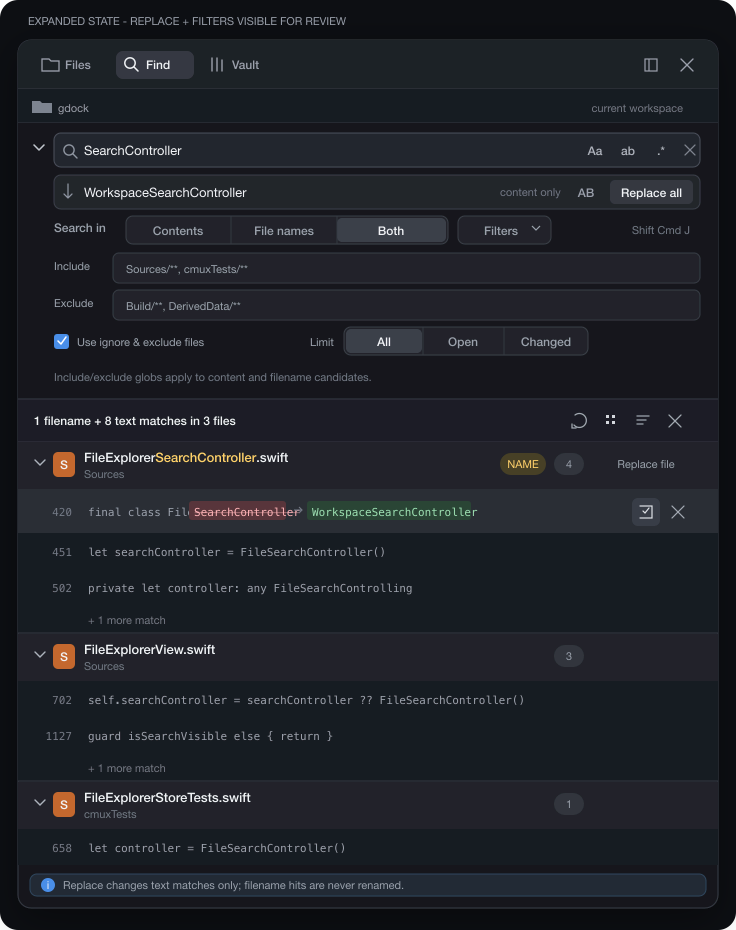

# PRD: Gdock Find Panel — Contents, Filenames, and Replace

## 0. Source Context

**Derived From:** Codex CLI session named `search plan`
  (`01a06577-56fa-7101-a3b0-c7f777498fc6`, 2026-09-03). Operator request:
  improve Find buttons/toggles, add find-and-replace, VS Code Find-in-Files
  parity, and an explicit Contents / File names / Both mode — mockup first,
  no code until UX approval. This PRD captures that design so implementation
  can start.
**Feature Name:** Gdock Find Panel (contents, filenames, replace)
**PRD Owner:** Brian Stoker
**Last Updated:** 2026-09-03
**Repository:** `stokd-cloud/gdock` (fork of `manaflow-ai/cmux`)
**Landing:** fork-only on `main`
**Authoring mode:** prd-create (not prd-forge)
**This task:** author this document and park the mockup. It does not
  implement Find, does not run `stokd project create`, and does not touch Swift.

### Charter

Give gdock Find the VS Code Search control surface: search file **contents**,
**file names**, or **both**; match-case / whole-word / regex / preserve-case
toggles; include/exclude filters; grouped results with exact-line open; and
replace with preview, scoped apply, confirm, and undo. Keep Files as a
separate rail tool. Do not rename files from Replace. Do not change
terminal or browser in-surface Find.

### Summary

Find today is a single `NSSearchField` over ripgrep with `--smart-case
--fixed-strings` and a hardcoded exclude-glob list. Results are a flat
table. There is no filename search, no regex/whole-word UI, no filters, and
no replace.

This project upgrades **only** the Find presentation of
`FileExplorerPanelView` (right-rail `.find` / Cmd+Shift+F) to the mockup
below. Files stays a tree. Terminal Cmd+F and browser Cmd+F stay as they
are.

### Visual contract

The Codex session rendered this mockup in-memory only. It now lives with
this PRD:

- Raster: `.stokd/projects/gdock-find-replace/mockup.png` (736×930)
- Source: `.stokd/projects/gdock-find-replace/mockup.svg`



The mockup is the **expanded review state**. Shipping chrome keeps
**Contents | File names | Both** always visible. Replace and Filters are
collapsed until opened.

### Locked UX (from `search plan`)

- Files and Find stay separate rail tools.
- `Contents | File names | Both` is always visible. First-use default is
  Contents.
- Both deduplicates files, labels filename hits (`NAME`), and nests content
  matches under those files.
- `Aa`, `ab`, `.*`, `AB` mean match case, whole word, regex, and preserve
  case (preserve case is a replace option).
- Filters: include/exclude globs, honor ignore files, `All | Open | Changed`.
- Results group by file with tree/list, refresh/stop, collapse, dismiss, and
  exact line navigation.
- Replace supports match / file / folder / global scope, previews edits,
  confirms bulk apply, and offers Undo.
- Replace is disabled for File names. In Both it changes **content only**.
- Compact sidebars stack controls; they must not hide the scope selector.

### Source inventory (read-only)

| Surface | Role today |
|---|---|
| `Sources/FileExplorerView.swift` | `FileExplorerPanelPresentation.files \| .find`; Find shows a single search field + flat results table |
| `Sources/FileExplorerSearchController.swift` | `FileSearchController`: local-only rg `--json --smart-case --fixed-strings`, max 500 hits, hardcoded `!.git/**` / `!node_modules/**` / `!DerivedData/**` globs |
| `Sources/FileExplorerSearchField.swift` | `FileExplorerSearchField` (`FileExplorerSearchField` a11y id) |
| `Sources/FileExplorerSearchResultsTableView.swift` | Flat `NSTableView` of `FileSearchResult` |
| `Sources/FileExplorerSearchResultCellView.swift` | One-line path + preview cell |
| `Sources/KeyboardShortcutSettings.swift` | `find` Cmd+F, `findInDirectory` Cmd+Shift+F, `findNext`/`findPrevious`/`hideFind`/`useSelectionForFind`. No replace action. |
| `Sources/Sidebar/RightSidebarSelectionRouter.swift` | `.findInDirectory` focuses the Find rail |
| `cmuxTests/FileSearchRipgrepParserTests.swift` | JSON match-line parser |
| `cmuxTests/FileExplorerStoreTests.swift` | Search messages, field lookup |
| `Packages/macOS/CmuxSettings/.../GdockCatalogSection.swift` | Fork settings catalog (`gdock.*`) |
| VS Code Search | Oracle for Find-in-Files + replace-in-files interaction |

---

## 1. Objectives & Constraints

### Objectives

- Search **contents**, **file names**, or **both** from one Find panel, with
  the scope selector always visible and first-use default **Contents**.
- Expose match-case, whole-word, regex, and (for replace) preserve-case.
- Add include/exclude globs, ignore-file honor, and All / Open / Changed.
- Group results by file; in Both, mark filename hits and nest content hits.
- Open a result at the recorded line and column.
- Add replace with match/file/folder/global scope, preview, confirm, undo;
  never rename files.
- Leave Files quick-search, terminal Find, and browser Find unchanged.
- Localize every new string (en+ja). New settings and palette ids use
  `gdock.` / `palette.gdock.`. New shortcuts go through
  `KeyboardShortcutSettings`.

### Constraints

- **Fork-only** on `stokd-cloud/gdock` `main`.
- **TDD:** red tests before implementation for each behavioral work item.
- Find is local-folder only today (`FileSearchSnapshot.Status.unsupported`
  for remote). This project does not add remote search; remote stays
  unsupported with the existing status string.
- Snapshot-boundary / no `body` writes: result rows must not hold store
  references.
- Ripgrep remains the search engine. Filename mode uses rg `--files` + glob
  / file-name match, not a second indexer.
- New tests wired into `cmux.xcodeproj`;
  `./scripts/lint-pbxproj-test-wiring.sh` green.
- Mockup is expanded-for-review; default chrome is compact.

### Scope Inventory

- Find-panel query model: Contents / File names / Both.
- Match-case, whole-word, regex, preserve-case toggles.
- Filters: include/exclude globs, ignore files, All | Open | Changed.
- Grouped results UI, filename `NAME` badge, nested content hits, refresh /
  stop / collapse / dismiss.
- Exact line+column open from a content hit.
- Replace field, scoped apply, preview, bulk confirm, undo; replace disabled
  in File names.
- Find chrome matching `mockup.png` (compact default, expanded review).
- Isolation of Files presentation and terminal/browser Find.
- `gdock.*` settings, shortcut catalog, en+ja localization, pbxproj wiring.

### Non-Goals

- VS Code Search Editor (dedicated editor tab of results).
- AI / notebook / semantic search.
- Bulk filename rename from Replace.
- Multi-root workspace search beyond the current Find root.
- Changing Files-mode tree filtering or the Files header path bar.
- Changing terminal Cmd+F or browser Cmd+F overlays.
- Remote / SSH ripgrep (remains unsupported).
- Upstream `manaflow-ai/cmux` PR unless later extracted.

---

## 1.5 Required Toolchain

| Tool | Min Version | Install Command | Verify Command |
|------|-------------|-----------------|----------------|
| macOS | 14.0 | (OS) | `sw_vers -productVersion` |
| Xcode | 16.0 | App Store | `xcodebuild -version` |
| Swift | 6.0 | bundled with Xcode | `swift --version` |
| ripgrep (`rg`) | 14.0 | `brew install ripgrep` | `rg --version` |
| git | 2.40 | Xcode CLT | `git --version` |
| Python 3 | 3.11 | Xcode CLT / brew | `python3 --version` |
| stokd CLI | current | `curl -fsSL https://stokd.cloud/install \| sh` | `stokd --version` |

Working directory for all Verification Commands: gdock repo root.

---

## 2. Contract

**VAL-FIND-001** — Find searches contents, file names, or both.
Surface: library
Needs: none
Behavior: Given a local Find root and a non-empty query, Contents returns
  only in-file text matches; File names returns only path-segment matches;
  Both returns the union, one row identity per file, with filename hits
  distinct from content hits. First-use default scope is Contents. An empty
  query does not search.
Evidence: Persist RED → GREEN `FileSearchScopeTests` covering the three
  scopes against a fixture tree that has a filename hit, a content hit in a
  differently named file, and a file that is both.
Rigor: R2
Why: Scope is the product fork from today's contents-only rg invocation and
  is fully fixture-testable.
Fail: File names returning file contents, or Both collapsing the two hit
  kinds into one undifferentiated list.

**VAL-FIND-002** — Match-case, whole-word, and regex toggles change matching.
Surface: library
Needs: VAL-FIND-001
Behavior: Off/off/off keeps today's smart-case fixed-string match. `Aa` on
  forces case-sensitive. `ab` on requires a word boundary. `.*` on treats
  the query as regex (invalid regex yields a failed snapshot, not a hang).
  Combinations compose. Preserve-case (`AB`) does not affect search, only
  replace (VAL-FIND-006).
Evidence: Persist RED → GREEN `FileSearchMatchFlagTests` asserting rg
  argument mapping and match/no-match fixtures per flag, including invalid
  regex → `.failed`.
Rigor: R2
Why: Flag-to-rg mapping is a pure argument builder with deterministic
  fixtures.
Fail: Regex mode still passing `--fixed-strings`, or an invalid pattern
  leaving the panel in `.searching`.

**VAL-FIND-003** — Filters limit which files are candidates.
Surface: library
Needs: VAL-FIND-001
Behavior: Include globs restrict candidates; exclude globs drop them;
  "use ignore files" on honors `.gitignore` / rg ignore (today's default);
  off searches ignored files too. Limit All searches the Find root; Open
  restricts to open editors; Changed restricts to git-dirty paths in that
  root. Globs apply to both content and filename candidates.
Evidence: Persist RED → GREEN `FileSearchFilterTests` with include/exclude
  fixtures, ignore on/off, and Open/Changed candidate sets.
Rigor: R2
Why: Candidate filtering is independent of result chrome and must not
  silently disagree with the tree's ignore rules.
Fail: Exclude glob still returning hits, or Changed including clean files.

**VAL-FIND-004** — Both groups filename hits and nests content matches.
Surface: library
Needs: VAL-FIND-001
Behavior: In Both, a file with a filename hit shows a `NAME` badge and
  count; content matches nest under that file; a file that is only a
  content hit has no `NAME` badge. Duplicate file rows are not listed.
  Contents-only and File-names-only do not show the opposite hit kind.
Evidence: Persist RED → GREEN `FileSearchResultGroupingTests` for Both
  nesting, Contents-only (no NAME rows), and File-names-only (no nested
  content rows).
Rigor: R2
Why: Grouping is the observable difference from the current flat
  `FileSearchResult` table.
Fail: Both showing two rows for the same file, or Contents showing NAME
  badges.

**VAL-FIND-005** — Replace never renames files.
Surface: library
Needs: VAL-FIND-001
Behavior: When scope is File names, the replace field and Replace all are
  disabled. When scope is Both, apply changes file contents only; paths are
  untouched. When scope is Contents, apply is content-only.
Evidence: Persist RED → GREEN `FileSearchReplaceSafetyTests` that File
  names has `isReplaceEnabled == false`, and Both apply on a filename+content
  fixture leaves the path unchanged while editing matching line text.
Rigor: R2
Why: Filename mutation is an explicit non-goal; a missed guard is data loss.
Fail: Replace all in File names renaming a file, or Both rewriting a path.

**VAL-FIND-006** — Replace previews, scopes, confirms bulk, and undoes.
Surface: library
Needs: VAL-FIND-005
Behavior: Replace-all with more than one file (or a folder/global scope)
  shows a preview of path + line diffs and requires confirm. Scopes are
  current match, current file, current folder, and all results. Preserve
  case (`AB`) preserves identifier case in replacements. Undo restores the
  last successful apply. A failed write rolls back that file and reports it;
  other files already written stay written and remain undoable as a batch.
Evidence: Persist RED → GREEN `FileSearchReplaceApplyTests` for each scope,
  preview payload, confirm gate on multi-file, preserve-case, undo, and
  partial-write failure.
Rigor: R2
Why: Multi-file replace is destructive; preview + undo must be proven
  without launching the app.
Fail: Multi-file replace writing with no preview, or Undo leaving mixed
  new/old content with no error.

**VAL-FIND-007** — Opening a content hit lands on the recorded line.
Surface: library
Needs: VAL-FIND-004
Behavior: Activating a nested content row opens that file at
  `lineNumber`/`columnNumber` from the rg match. Activating a filename-only
  row opens the file without requiring a line jump. Missing files produce a
  status error, not a crash.
Evidence: Persist RED → GREEN `FileSearchOpenTargetTests` that the open
  command carries path + line + column for content hits and path-only for
  NAME rows.
Rigor: R1
Why: Line targeting is a single command payload; persistence of the unit
  test is the evidence floor.
Fail: Opening a content hit at line 1 regardless of the match line.

**VAL-FIND-008** — Files, terminal Find, and browser Find stay as they are.
Surface: library
Needs: none
Behavior: `FileExplorerPanelPresentation.files` does not gain the Find
  scope selector, replace field, or grouped-results table. Cmd+F in a
  terminal surface still opens terminal find; Cmd+F in a browser surface
  still opens browser find. Cmd+Shift+F still focuses the Find rail.
Evidence: Persist RED → GREEN `FileExplorerFindIsolationTests` plus existing
  `find` / `findInDirectory` shortcut routing tests remaining green.
Rigor: R1
Why: Isolation is a regression against already-passing shortcut tests.
Fail: Files presentation rendering Replace all, or Cmd+F stealing terminal
  find into the rail.

**VAL-FIND-009** — New strings, settings, and shortcuts are catalogued.
Surface: artifact
Needs: VAL-FIND-001
Behavior: Every new user-facing string has `String(localized:)` keys in
  `Resources/Localizable.xcstrings` (en+ja). New settings live under
  `gdock.find*` in `GdockCatalogSection` (not `app.*` / `sidebar.*`). New
  replace/toggle shortcuts are `KeyboardShortcutSettings` actions, editable
  in Settings and `cmux.json`. New tests have pbxproj source entries.
Evidence: Localization audit of added keys; schema grep for `gdock.find`;
  `./scripts/lint-pbxproj-test-wiring.sh` exit 0.
Rigor: R1
Why: Catalog and localization are grep-checkable; wiring is an existing
  scripted gate.
Fail: Hardcoded English in Find chrome, or a new test file that xcodebuild
  never compiles.

**VAL-FIND-010** — Find chrome matches the parked mockup.
Surface: artifact
Needs: VAL-FIND-001, VAL-FIND-006
Behavior: The Find panel shows Contents | File names | Both at all widths.
  Replace and Filters are collapsed by default and expand in place. Compact
  widths stack controls without hiding the scope selector. The expanded
  state matches `.stokd/projects/gdock-find-replace/mockup.png` for control
  presence and grouping (not pixel-identical chrome).
Evidence: Persist a tagged dogfood screenshot of compact and expanded
  Find against `mockup.png`, plus a layout unit test that the scope control
  remains non-zero width at a 240pt panel.
Rigor: R1
Why: Visual contract is the parked mockup; layout collapse is a unit-tested
  width constraint.
Fail: Scope selector scrolling off-screen in a narrow rail, or Replace
  expanded on first open.

---

## 3. Execution Topology

## Phase 1: Ship Find contents / filenames / replace
**Purpose:** One unattended pass that makes the contract true against the
  parked mockup; no human checkpoint is required after this PRD.

### 1.1 Query model and ripgrep argument builder
**Targets:** VAL-FIND-001, VAL-FIND-002, VAL-FIND-003
**Dependencies:** []

**Implementation Details**

- Extend `FileSearchController` / `FileSearchSnapshot` with a value-type
  query: scope (`contents` | `fileNames` | `both`), matchCase, wholeWord,
  regex, includeGlobs, excludeGlobs, useIgnoreFiles, limit
  (`all` | `open` | `changed`).
- Keep rg as the process. Contents: current `--json` match path with flags
  replacing the hardcoded `--smart-case --fixed-strings`. File names: rg
  file listing filtered by the query (literal or regex) against relative
  paths. Both: one contents search + one filename search, merged by path.
- Map flags: matchCase → `--case-sensitive` (else `--smart-case`);
  wholeWord → `--word-regexp`; regex off → `--fixed-strings`. Invalid regex
  → `.failed` with a localized message.
- Include/exclude → extra `--glob`. useIgnoreFiles off → `--no-ignore`.
  Open/Changed restrict the path arguments, not a second engine.
- Remote roots stay `.unsupported`. Empty query stays `.idle`.
- Failure modes: missing rg (existing message), non-zero rg other than 1
  (existing), invalid regex, malformed glob (skip that glob, do not hide
  everything).

**Acceptance Criteria**

- AC-1.1.a: A `FileSearchQuery` value type exists with scope, match flags,
  and filter fields and does not reference `FileExplorerStore` → import
  inspection.
- AC-1.1.b: Contents / File names / Both against the fixture tree return
  the hit kinds in VAL-FIND-001 → `FileSearchScopeTests` fail before the
  builder exists, pass after.
- AC-1.1.c: `rg --fixed-strings` is absent from the argument list when
  regex is on, and invalid regex emits `.failed` → `FileSearchMatchFlagTests`.
- AC-1.1.d: Exclude glob `DerivedData/**` drops those hits; useIgnoreFiles
  off includes a gitignored fixture file → `FileSearchFilterTests`.

**Acceptance Tests**

- Test-1.1.a: Unit — `FileSearchQuery` is Sendable/Equatable with no AppKit
  import.
- Test-1.1.b: Unit — `FileSearchScopeTests` (maps to AC-1.1.b).
- Test-1.1.c: Unit — `FileSearchMatchFlagTests` (maps to AC-1.1.c).
- Test-1.1.d: Unit — `FileSearchFilterTests` (maps to AC-1.1.d).

**Verification Commands**

```bash
rg -n 'enum FileSearchScope|struct FileSearchQuery' Sources --glob '*.swift'
./scripts/lint-pbxproj-test-wiring.sh
```

### 1.2 Grouped results and line navigation
**Targets:** VAL-FIND-004, VAL-FIND-007
**Dependencies:** ["1.1"]

**Implementation Details**

- Replace the flat `[FileSearchResult]` presentation in Find with a grouped
  snapshot: file header (path, NAME badge, counts) + nested content rows
  (line, column, preview, match ranges).
- Contents: file headers + nested content only. File names: file headers
  with NAME, no nested content. Both: merge as VAL-FIND-004.
- Open: content row → existing file-open path with line/column. NAME row →
  path only. Missing file → status, no crash.
- Tree/list toggle, refresh, stop, collapse-all, dismiss bind to the
  existing cancel/search APIs; they do not invent a second process.
- Rows receive immutable snapshots; no store below the table boundary.

**Acceptance Criteria**

- AC-1.2.a: Both grouping matches VAL-FIND-004 on the fixture →
  `FileSearchResultGroupingTests`.
- AC-1.2.b: Content-row open payload includes line and column; NAME-row
  open payload is path-only → `FileSearchOpenTargetTests`.
- AC-1.2.c: Result cell views compile without importing `FileExplorerStore`.

**Acceptance Tests**

- Test-1.2.a: Unit — `FileSearchResultGroupingTests` (maps to AC-1.2.a).
- Test-1.2.b: Unit — `FileSearchOpenTargetTests` (maps to AC-1.2.b).
- Test-1.2.c: Unit — grouping types live outside `FileExplorerView.swift`
  and do not import the store (maps to AC-1.2.c).

**Verification Commands**

```bash
rg -n 'NAME|filenameHit|FileSearchGrouped' Sources --glob '*FileSearch*'
./scripts/lint-pbxproj-test-wiring.sh
```

### 1.3 Replace pipeline
**Targets:** VAL-FIND-005, VAL-FIND-006
**Dependencies:** ["1.1"]

**Implementation Details**

- Add a replace controller that consumes the grouped snapshot + replace
  string + scope (match / file / folder / all) + preserveCase.
- `isReplaceEnabled` is false when scope is File names.
- Preview is a list of `{path, line, before, after}` computed in memory
  before any write. Multi-file or folder/all requires confirm.
- Apply writes through the local file provider only. Record a batch undo
  snapshot. Partial failure stops, reports the file, keeps prior writes in
  the undo batch.
- Preserve-case uses identifier-style case preservation (Foo/foo/FOO), not
  locale title-case.
- Failure modes: file disappeared, file not writable, replace regex
  invalid → per-file error, no crash.

**Acceptance Criteria**

- AC-1.3.a: File names → replace disabled; Both apply does not rename →
  `FileSearchReplaceSafetyTests`.
- AC-1.3.b: Each apply scope, preview, confirm-on-multi-file, preserve-case,
  undo, and partial-write failure pass → `FileSearchReplaceApplyTests`.
- AC-1.3.c: Replace types do not import AppKit; writes go through an
  injected file writer in tests.

**Acceptance Tests**

- Test-1.3.a: Unit — `FileSearchReplaceSafetyTests` (maps to AC-1.3.a).
- Test-1.3.b: Unit — `FileSearchReplaceApplyTests` (maps to AC-1.3.b).
- Test-1.3.c: Unit — replace controller uses a `FileReplacing` test double
  (maps to AC-1.3.c).

**Verification Commands**

```bash
rg -n 'isReplaceEnabled|FileSearchReplace' Sources --glob '*.swift'
./scripts/lint-pbxproj-test-wiring.sh
```

### 1.4 Find chrome matching the mockup
**Targets:** VAL-FIND-010
**Dependencies:** ["1.2", "1.3"]

**Implementation Details**

- Rebuild the Find header in `FileExplorerContainerView` to match
  `mockup.png`: query field, match toggles, replace field (collapsed),
  scope segmented control always visible, Filters disclosure, results
  toolbar (refresh/stop, tree/list, collapse, dismiss).
- Default: replace row and filter rows hidden. Expanded state used for
  review/screenshots.
- At ≤240pt width, stack vertically; scope control remains fully visible.
- Accessibility ids for new controls (`FileExplorerSearchScope`,
  `FileExplorerReplaceField`, match toggles) so UITests can drive them.
- Presentation `.files` continues to hide this chrome (enforced in 1.5).

**Acceptance Criteria**

- AC-1.4.a: Scope control width > 0 at 240pt panel width → layout test.
- AC-1.4.b: Replace and Filters start collapsed → unit test on
  `isReplaceExpanded` / `isFiltersExpanded` defaults.
- AC-1.4.c: Tagged dogfood screenshot of expanded Find compared to
  `mockup.png` for control presence (scope Both, NAME badge, replace row,
  include/exclude, All/Open/Changed).

**Acceptance Tests**

- Test-1.4.a: Unit — compact-width layout (maps to AC-1.4.a).
- Test-1.4.b: Unit — collapsed defaults (maps to AC-1.4.b).
- Test-1.4.c: Artifact — dogfood stills stored with the tag (maps to
  AC-1.4.c).

**Verification Commands**

```bash
rg -n 'FileExplorerSearchScope|isReplaceExpanded|isFiltersExpanded' Sources --glob '*.swift'
test -s .stokd/projects/gdock-find-replace/mockup.png
```

### 1.5 Isolation, catalog, localization, and wiring
**Targets:** VAL-FIND-008, VAL-FIND-009
**Dependencies:** ["1.4"]

**Implementation Details**

- Guard Find-only chrome behind `presentation == .find`.
- Do not route terminal/browser Cmd+F through the new Find header.
  `findInDirectory` remains Cmd+Shift+F → Find rail.
- Add replace / toggle-regex shortcuts (VS Code-like Cmd+Option+F and
  Cmd+Alt+R are candidates) as new `KeyboardShortcutSettings.Action`
  cases, Settings-editable, documented.
- New `gdock.find*` keys in `GdockCatalogSection` for last-used scope,
  match flags, and filter expansion if persisted; first-use default
  Contents even when persisted flags exist.
- Localize every new string in `Resources/Localizable.xcstrings` and web
  schema copy in `web/messages/en.json` + `web/messages/ja.json`.
- Wire every new `cmuxTests/*.swift` file into the pbxproj.

**Acceptance Criteria**

- AC-1.5.a: Files presentation has no replace field / scope control →
  `FileExplorerFindIsolationTests`.
- AC-1.5.b: Existing find / findInDirectory routing tests still pass.
- AC-1.5.c: `gdock.find` appears in the settings catalog; no new keys
  under `app.*` / `sidebar.*`.
- AC-1.5.d: `./scripts/lint-pbxproj-test-wiring.sh` exits 0.
- AC-1.5.e: Localization audit lists every new Find string in en+ja.

**Acceptance Tests**

- Test-1.5.a: Unit — `FileExplorerFindIsolationTests` (maps to AC-1.5.a).
- Test-1.5.b: Unit — existing shortcut routing tests (maps to AC-1.5.b).
- Test-1.5.c: Unit/grep — catalog prefix (maps to AC-1.5.c).
- Test-1.5.d: Script — pbxproj wiring (maps to AC-1.5.d).
- Test-1.5.e: Audit — xcstrings + web messages (maps to AC-1.5.e).

**Verification Commands**

```bash
rg -n 'gdock\.find' Packages/macOS/CmuxSettings Sources web --glob '*.{swift,json}'
./scripts/lint-pbxproj-test-wiring.sh
python3 scripts/check-workspace-package-groups.py
```

---

## 4. Completion Criteria

- Every VAL-FIND-* assertion has persisted RED → GREEN evidence from its
  owning work item.
- `./scripts/lint-pbxproj-test-wiring.sh` exits 0.
- Tagged dogfood build shows compact Find and expanded Find against
  `mockup.png`.
- Localization audit recorded for en+ja.
- Files rail, terminal Find, and browser Find still behave as on `main`
  before this project.

## 5. Rollout & Validation

### Rollout Strategy

- Fork-only gdock `main`. No feature flag required: Find is already a
  shipped rail; this replaces its chrome and query engine.
- Default scope Contents preserves today's contents-only first impression.
- Persist last-used flags under `gdock.find*` so power users keep regex /
  filters across launches without changing first-run default for new
  profiles.

### Post-Launch Validation

- Dogfood Cmd+Shift+F on a real gdock checkout: Contents hit, File names
  hit, Both NAME + nested lines, replace preview on two files, undo.
- Confirm Cmd+F in a terminal pane still opens terminal find.

## 6. Open Questions

- Persist last-used scope (Contents / File names / Both) across launches,
  or always reset to Contents? Default in this PRD: persist flags, but
  first-use (no `gdock.find.scope` key) is Contents.
- Exact default chords for Replace and Toggle Regex if Cmd+Option+F /
  Cmd+Alt+R collide with an existing user binding — Settings remains the
  override; document the collision in the shortcut catalog if one exists
  at implement time.
